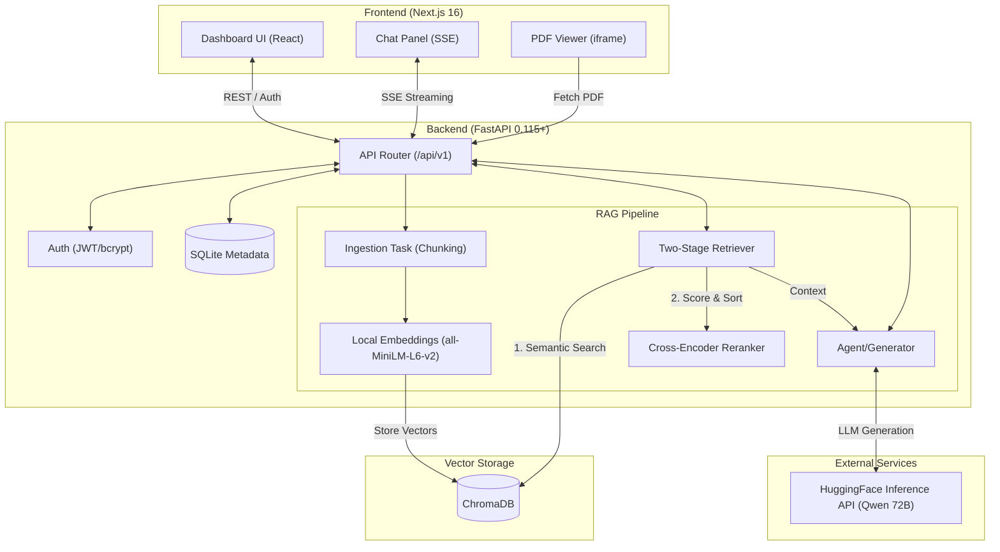

<div align="center">

<br/>

```
██████╗ ██████╗ ███████╗     █████╗ ███████╗███████╗██╗███████╗████████╗ █████╗ ███╗   ██╗████████╗
██╔══██╗██╔══██╗██╔════╝    ██╔══██╗██╔════╝██╔════╝██║██╔════╝╚══██╔══╝██╔══██╗████╗  ██║╚══██╔══╝
██████╔╝██║  ██║█████╗      ███████║███████╗███████╗██║███████╗   ██║   ███████║██╔██╗ ██║   ██║
██╔═══╝ ██║  ██║██╔══╝      ██╔══██║╚════██║╚════██║██║╚════██║   ██║   ██╔══██║██║╚██╗██║   ██║
██║     ██████╔╝██║         ██║  ██║███████║███████║██║███████║   ██║   ██║  ██║██║ ╚████║   ██║
╚═╝     ╚═════╝ ╚═╝         ╚═╝  ╚═╝╚══════╝╚══════╝╚═╝╚══════╝   ╚═╝   ╚═╝  ╚═╝╚═╝  ╚═══╝   ╚═╝
                                                                                                    
                        ██████╗  █████╗  ██████╗
                        ██╔══██╗██╔══██╗██╔════╝
                        ██████╔╝███████║██║  ███╗
                        ██╔══██╗██╔══██║██║   ██║
                        ██║  ██║██║  ██║╚██████╔╝
                        ╚═╝  ╚═╝╚═╝  ╚═╝ ╚═════╝
```

### Enterprise Agentic Retrieval-Augmented Generation System

<br/>

[](https://fastapi.tiangolo.com/)
[](https://nextjs.org/)
[](https://python.org/)
[](https://langchain.com/)
[](https://trychroma.com/)
[](https://huggingface.co/)
[](https://docker.com/)
[](LICENSE)

<br/>

> **Upload · Embed · Retrieve · Chat** — A production-grade AI document assistant built end-to-end with an agentic RAG pipeline, streaming responses, and per-user data isolation.

<br/>

[Features](#-key-features) · [Tech Stack](#-tech-stack) · [Getting Started](#-getting-started) · [Architecture](#-architecture) · [RAG Pipeline](#-rag-pipeline) · [API Reference](#-api-reference) · [Deployment](#-deployment) · [Contributing](#-contributing)

---

</div>

## 🤝 Contributors

Thanks to all the amazing people who have contributed to **PDF-Assistant-RAG**! 🎉

<br/>

<div align="center">

<table>
  <tbody>
    <tr>
      <td align="center" valign="top" width="14.28%">
        <a href="https://github.com/param20h">
          
          <br/><sub><b>param20h</b></sub>
        </a>
        <br/>💻 🚇 📖
      </td>
      <td align="center" valign="top" width="14.28%">
        <a href="https://github.com/Yuvraj-Sarathe">
          
          <br/><sub><b>Yuvraj-Sarathe</b></sub>
        </a>
        <br/>💻 🧪 🔒
      </td>
      <td align="center" valign="top" width="14.28%">
        <a href="https://github.com/SatyamPrakash09">
          
          <br/><sub><b>SatyamPrakash09</b></sub>
        </a>
        <br/>💻 🔒 ⚡
      </td>
      <td align="center" valign="top" width="14.28%">
        <a href="https://github.com/akmhatey-ai">
          
          <br/><sub><b>akmhatey-ai</b></sub>
        </a>
        <br/>💻 🐛
      </td>
      <td align="center" valign="top" width="14.28%">
        <a href="https://github.com/drishtisharma14052007-eng">
          
          <br/><sub><b>drishtisharma14052007-eng</b></sub>
        </a>
        <br/>💻 🎨
      </td>
      <td align="center" valign="top" width="14.28%">
        <a href="https://github.com/Pika-pika06">
          
          <br/><sub><b>Pika-pika06</b></sub>
        </a>
        <br/>💻
      </td>
      <td align="center" valign="top" width="14.28%">
        <a href="https://github.com/algojogacor">
          
          <br/><sub><b>algojogacor</b></sub>
        </a>
        <br/>💻
      </td>
    </tr>
    <tr>
      <td align="center" valign="top" width="14.28%">
        <a href="https://github.com/HirenGajjar">
          
          <br/><sub><b>HirenGajjar</b></sub>
        </a>
        <br/>💻
      </td>
      <td align="center" valign="top" width="14.28%">
        <a href="https://github.com/Kaustub26Pvgda">
          
          <br/><sub><b>Kaustub26Pvgda</b></sub>
        </a>
        <br/>💻
      </td>
      <td align="center" valign="top" width="14.28%">
        <a href="https://github.com/blinkerbit">
          
          <br/><sub><b>blinkerbit</b></sub>
        </a>
        <br/>💻
      </td>
      <td align="center" valign="top" width="14.28%">
        <a href="https://github.com/akshy-yy">
          
          <br/><sub><b>akshy-yy</b></sub>
        </a>
        <br/>💻
      </td>
    </tr>
  </tbody>
</table>

</div>

---

<br/>

## 🌟 Overview

**PDF-Assistant-RAG** is a complete, production-ready AI document assistant that lets users upload complex PDFs, financial reports, legal contracts, and research papers — then chat with an AI that provides **accurate, cited answers** powered by a multi-stage Retrieval-Augmented Generation pipeline.

The system uses **semantic search + cross-encoder reranking** to find the most relevant document chunks, streams AI-generated answers token-by-token, and highlights exact source citations with page numbers — all inside a sleek Next.js UI with JWT-secured per-user data isolation.

<br/>

## 🏗️ Architecture



<br/>

## 🛠 Tech Stack

<div align="center">

### Backend

| | Technology | Purpose |
|---|---|---|
|  | **FastAPI 0.115+** | Async REST API framework |
|  | **Python 3.11** | Runtime environment |
|  | **SQLite + SQLAlchemy** | User & document metadata storage |
|  | **JWT + Passlib** | Authentication & authorization |
|  | **LangChain** | RAG orchestration |
|  | **ChromaDB** | Persistent vector store (per-user) |
|  | **HuggingFace Hub** | LLM inference API |

### Frontend

| | Technology | Purpose |
|---|---|---|
|  | **Next.js 16** | React framework (App Router) |
|  | **Tailwind CSS v4** | Utility-first styling |
|  | **shadcn/ui** | Accessible component library |
|  | **TypeScript** | Type-safe frontend |
|  | **react-pdf** | In-browser PDF viewer |
|  | **react-markdown + GFM** | Markdown-rendered AI responses |

### AI / ML Pipeline

| | Technology | Purpose |
|---|---|---|
|  | **all-MiniLM-L6-v2** | Local sentence embeddings |
|  | **ms-marco-MiniLM-L-6-v2** | Cross-encoder reranker |
|  | **Qwen2.5-72B-Instruct** | LLM (HuggingFace Inference API) |
|  | **PyMuPDF + python-docx** | Document parsing |

### DevOps & Tooling

| | Technology | Purpose |
|---|---|---|
|  | **Docker Multi-Stage** | Containerized deployment |
|  | **GitHub Actions** | CI pipeline (dev branch) |
|  | **Git LFS** | Binary asset management |
|  | **HuggingFace Spaces** | Production deployment |

</div>

<br/>

## ✨ Key Features

<table>
<tr>
<td width="33%" valign="top">

### 👤 Users
- 🔐 JWT-secured register & login
- 📄 Upload **PDF** and **DOCX** documents
- 💬 Ask questions in natural language
- 🌊 **Streaming AI responses** token-by-token
- 📚 Inline **source citations** with page numbers
- 🗂️ Per-user complete data isolation

</td>
<td width="33%" valign="top">

### 🤖 RAG Pipeline
- 🔪 Smart **recursive text chunking** (configurable size & overlap)
- 🧠 **Local embeddings** — no data leaves your machine
- 🔍 **Two-stage retrieval** — semantic search → cross-encoder rerank
- ✂️ Top-K filtering for precision answers
- 📝 Custom **system prompts** with citation instructions
- 🧾 Source scoring with confidence levels

</td>
<td width="33%" valign="top">

### ⚙️ Engineering
- 🚀 **Async FastAPI** with Server-Sent Events streaming
- 🗄️ **ChromaDB** with persistent per-user collections
- 🐳 **Multi-stage Docker** build (Node → Python)
- 🔄 **GitHub Actions CI** on `dev` branch
- 🛡️ CORS, file validation, JWT expiry
- 📊 Chat **history persistence** per document

</td>
</tr>
</table>

<br/>

## 📁 Project Structure

```
PDF-Assistant-RAG/
│
├── backend/                          # FastAPI + RAG server
│   ├── app/
│   │   ├── main.py                   # App entrypoint, middleware, static files
│   │   ├── config.py                 # Pydantic settings (env vars)
│   │   ├── database.py               # SQLAlchemy async engine
│   │   ├── models.py                 # ORM models (User, Document, Message)
│   │   ├── schemas.py                # Pydantic request/response schemas
│   │   ├── auth.py                   # JWT creation & verification
│   │   │
│   │   ├── routes/
│   │   │   ├── auth.py               # POST /register, /login, /me
│   │   │   ├── documents.py          # Upload, list, delete, retrieve
│   │   │   └── chat.py               # Streaming chat + history
│   │   │
│   │   └── rag/
│   │       ├── agent.py              # Main RAG orchestrator
│   │       ├── chunker.py            # Recursive text splitter
│   │       ├── embeddings.py         # SentenceTransformer wrapper
│   │       ├── vectorstore.py        # ChromaDB collection manager
│   │       ├── retriever.py          # Semantic search + reranking
│   │       └── prompts.py            # System & user prompt templates
│   │
│   ├── requirements.txt
│   └── .env                          # Local env (never committed)
│
├── frontend/                         # Next.js 16 App Router
│   └── src/
│       ├── app/
│       │   ├── layout.tsx            # Root layout + fonts
│       │   ├── page.tsx              # Landing / redirect
│       │   ├── login/                # Auth pages
│       │   ├── register/
│       │   └── dashboard/            # Main app page
│       │
│       ├── components/
│       │   ├── chat/
│       │   │   ├── ChatPanel.tsx     # Chat UI + SSE streaming
│       │   │   ├── MessageBubble.tsx # User / assistant message
│       │   │   └── SourceCard.tsx    # Citation cards
│       │   ├── document/             # Upload + sidebar components
│       │   └── layout/               # Navbar, sidebar shell
│       │
│       └── lib/
│           └── api.ts                # Typed API client + SSE stream helper
│
├── .github/
│   ├── workflows/
│   │   ├── ci.yml                    # CI — runs on dev branch only
│   │   ├── deploy.yml                # Docker build — main branch only
│   │   └── devsecops.yml             # Security scans — main branch only
│   ├── ISSUE_TEMPLATE/               # Bug report & feature request forms
│   ├── pull_request_template.md      # PR checklist
│   └── CODEOWNERS                    # Auto-review assignment
│
├── Dockerfile                        # Multi-stage: Node build → Python serve
├── docker-compose.yml                # Local Docker stack
├── CONTRIBUTING.md                   # contributor guide
└── .env.example                      # Template for environment variables
```

<br/>

## 🚀 Getting Started

### Prerequisites

-  **Python 3.11+**
-  **Node.js 20+**
-  **HuggingFace account** (free) for LLM inference

---

### 1. Clone the Repository

```bash
git clone https://github.com/param20h/PDF-Assistant-RAG.git
cd PDF-Assistant-RAG
```

### 2. Configure Environment

```bash
cp .env.example backend/.env
```

Edit `backend/.env`:

```env
SECRET_KEY=your-strong-random-secret
DATABASE_URL=sqlite:///./data/app.db
HF_TOKEN=hf_your_huggingface_token_here
UPLOAD_DIR=./data/uploads
CHROMA_PERSIST_DIR=./data/chroma_db
```

> Get your free HuggingFace token at [huggingface.co/settings/tokens](https://huggingface.co/settings/tokens)

### 3. Run Locally

Open **two terminals**:

```bash
# Terminal A — Backend
cd backend
python -m venv .venv && source .venv/bin/activate   # Windows: .venv\Scripts\activate
pip install -r requirements.txt
uvicorn app.main:app --reload --port 8000
# → API running at http://localhost:8000
# → Swagger docs at http://localhost:8000/docs
```

```bash
# Terminal B — Frontend
cd frontend
npm install
npm run dev
# → App running at http://localhost:3000
```

### 4. Run with Docker

```bash
docker compose up --build
# → Full stack at http://localhost:7860
```

<br/>

## 🧠 RAG Pipeline

```
                    ┌─────────────────────────────────────────────┐
                    │              PDF / DOCX Upload               │
                    └───────────────────┬─────────────────────────┘
                                        │
                                        ▼
                    ┌─────────────────────────────────────────────┐
                    │         PyMuPDF / python-docx Parser         │
                    │         (text extraction per page)           │
                    └───────────────────┬─────────────────────────┘
                                        │
                                        ▼
                    ┌─────────────────────────────────────────────┐
                    │      Recursive Character Text Splitter       │
                    │   chunk_size=1000  |  overlap=200            │
                    └───────────────────┬─────────────────────────┘
                                        │
                                        ▼
                    ┌─────────────────────────────────────────────┐
                    │    all-MiniLM-L6-v2  (local embeddings)      │
                    │    384-dim dense vectors                      │
                    └───────────────────┬─────────────────────────┘
                                        │
                                        ▼
                    ┌─────────────────────────────────────────────┐
                    │   ChromaDB  — per-user persistent collection │
                    └─────────────────────────────────────────────┘

                              ── At Query Time ──

  User Question ──▶ Embed ──▶ Semantic Search (Top-K=10)
                                        │
                                        ▼
                         Cross-Encoder Reranker (Top-K=5)
                         ms-marco-MiniLM-L-6-v2
                                        │
                                        ▼
                    Prompt Assembly (system + context + question)
                                        │
                                        ▼
                    Qwen2.5-72B-Instruct (HF Inference API)
                                        │
                                        ▼
                    Streamed SSE tokens ──▶ Frontend ChatPanel
```

<br/>

## 📡 API Reference

| Method | Endpoint | Auth | Description |
|--------|----------|------|-------------|
| `POST` | `/api/v1/auth/register` | ❌ | Create a new user account |
| `POST` | `/api/v1/auth/login` | ❌ | Login and receive JWT token |
| `GET` | `/api/v1/auth/me` | ✅ | Get current user profile |
| `POST` | `/api/v1/documents/upload` | ✅ | Upload PDF/DOCX and trigger indexing |
| `GET` | `/api/v1/documents` | ✅ | List all documents for current user |
| `DELETE` | `/api/v1/documents/{id}` | ✅ | Delete a document and its vector data |
| `POST` | `/api/v1/chat/ask/stream` | ✅ | Ask a question (SSE streaming response) |
| `GET` | `/api/v1/chat/history/{doc_id}` | ✅ | Get chat history for a document |
| `DELETE` | `/api/v1/chat/history/{doc_id}` | ✅ | Clear chat history for a document |
| `GET` | `/health` | ❌ | Health check (db + chroma status) |

> Full interactive docs available at `/docs` (Swagger UI) when running locally.

<br/>

## 📦 Environment Variables

| Variable | Required | Default | Description | Where to Get It |
|---|---|---|---|---|
| `SECRET_KEY` | ✅ | — | JWT signing & session secret. Use a strong random string. | Generate: `python -c "import secrets; print(secrets.token_urlsafe(32))"` |
| `HF_TOKEN` | ✅ | — | HuggingFace API token for LLM inference via Inference API. | [huggingface.co/settings/tokens](https://huggingface.co/settings/tokens) (free) |
| `ENVIRONMENT` | ❌ | `development` | Runtime mode. Set to `production` for deployment to lock CORS. | — |
| `DEBUG` | ❌ | `False` | Enable debug mode with detailed error pages. Never enable in production. | — |
| `ALLOWED_ORIGINS` | ❌ | `http://localhost:3000,http://localhost:7860` | Comma-separated CORS origins (only enforced in production). | Your deployed domain(s) |
| `DATABASE_URL` | ❌ | `sqlite:///./data/app.db` | SQLAlchemy database connection string. | SQLite (default), or your Postgres/MySQL connection string |
| `JWT_ALGORITHM` | ❌ | `HS256` | JWT signing algorithm. | — |
| `JWT_EXPIRY_HOURS` | ❌ | `72` | JWT token lifetime in hours before re-login is required. | — |
| `UPLOAD_DIR` | ❌ | `./data/uploads` | Local directory for storing uploaded documents. | — |
| `MAX_FILE_SIZE_MB` | ❌ | `50` | Maximum allowed upload file size in MB. | — |
| `ALLOWED_EXTENSIONS` | ❌ | `pdf,docx,txt,md` | Comma-separated list of permitted file extensions. | — |
| `CHROMA_PERSIST_DIR` | ❌ | `./data/chroma_db` | Directory where ChromaDB persists its vector index. | — |
| `LLM_MODEL` | ❌ | `Qwen/Qwen2.5-72B-Instruct` | HuggingFace model ID for answer generation. | [huggingface.co/models](https://huggingface.co/models?inference=warm&sort=trending) |
| `LLM_TEMPERATURE` | ❌ | `0.3` | LLM sampling temperature (0 = deterministic, 1 = creative). | — |
| `LLM_MAX_NEW_TOKENS` | ❌ | `1024` | Maximum tokens per LLM response. | — |
| `EMBEDDING_MODEL` | ❌ | `sentence-transformers/all-MiniLM-L6-v2` | SentenceTransformer model for local embeddings (no external API). | [huggingface.co/sentence-transformers](https://huggingface.co/sentence-transformers) |
| `EMBEDDING_DIMENSION` | ❌ | `384` | Embedding vector dimension (must match the model). | — |
| `RERANKER_MODEL` | ❌ | `cross-encoder/ms-marco-MiniLM-L-6-v2` | Cross-encoder model for reranking retrieved chunks by relevance. | [huggingface.co/cross-encoder](https://huggingface.co/cross-encoder) |
| `CHUNK_SIZE` | ❌ | `1000` | Characters per document chunk. Larger = more context, smaller = better precision. | — |
| `CHUNK_OVERLAP` | ❌ | `200` | Overlap between consecutive chunks to maintain boundary context. | — |
| `TOP_K_RETRIEVAL` | ❌ | `10` | Candidate chunks retrieved from vector store during semantic search. | — |
| `TOP_K_RERANK` | ❌ | `5` | Final chunks passed to the LLM after reranking (must be ≤ `TOP_K_RETRIEVAL`). | — |

<br/>

## 📜 Scripts

### Backend (`backend/`)

| Command | Description |
|---------|-------------|
| `uvicorn app.main:app --reload` | Start FastAPI with hot reload |
| `uvicorn app.main:app --port 8000` | Start FastAPI on port 8000 |

### Frontend (`frontend/`)

| Command | Description |
|---------|-------------|
| `npm run dev` | Start **Next.js** dev server |
| `npm run build` | Production build → `out/` (static export) |
| `npm run lint` | Run ESLint |

### Docker

| Command | Description |
|---------|-------------|
| `docker compose up --build` | Build and start the full stack |
| `docker compose down` | Stop all containers |

<br/>

## 🌐 Deployment

This project is deployed on **HuggingFace Spaces** using Docker.

### HuggingFace Spaces

1. Fork this repo and create a new Space at [huggingface.co/new-space](https://huggingface.co/new-space) (SDK: Docker)
2. Set the following Space secrets:
   - `HF_TOKEN` — your HuggingFace API token
   - `SECRET_KEY` — a strong random string
3. Push to the `hf` remote — the Space will auto-build

```bash
git remote add hf https://<username>:<HF_TOKEN>@huggingface.co/spaces/<username>/<space-name>
git push hf main
```

### Self-Hosted / VPS

```bash
docker compose up -d --build
# App available at http://your-server:7860
```

<br/>

## 🤝 Contributing

This project is participating in **GirlScript Summer of Code**! We welcome contributors of all skill levels.

**Branch Strategy:**

| Branch | Purpose |
|--------|---------|
| `main` | Production — HuggingFace deployed (admin only) |
| `dev` | All contributor PRs target here |
| `feature/*` / `fix/*` / `docs/*` | Your working branches |

```bash
# Always branch from dev
git checkout -b feature/my-feature upstream/dev
```

**Quick links:**
- 📋 [Good First Issues](https://github.com/param20h/PDF-Assistant-RAG/issues?q=label%3A%22good+first+issue%22)
- 📖 [Contributing Guide](CONTRIBUTING.md)
- 💬 [Discussions](https://github.com/param20h/PDF-Assistant-RAG/discussions)

<br/>

## 📄 License

Distributed under the **MIT License**. See [`LICENSE`](license) for more information.

---

<div align="center">

<br/>

**Built with 💙 as a flagship AI engineering project**

*If you found this project helpful, please give it a ⭐ — it helps contributors discover it!*

<br/>

[](https://skillicons.dev)

<br/>

**[⬆ Back to top](#)**

</div>
