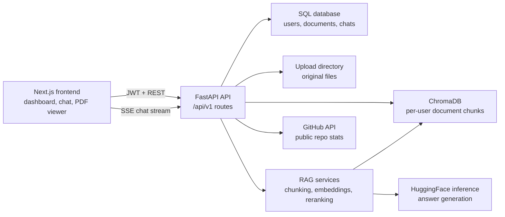
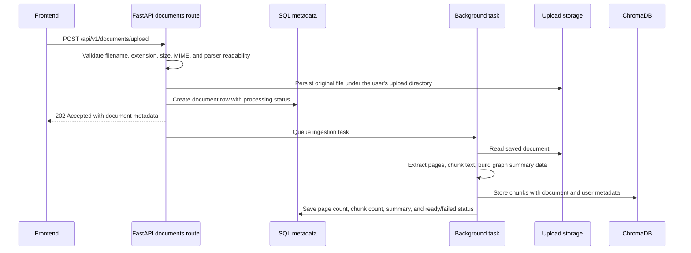
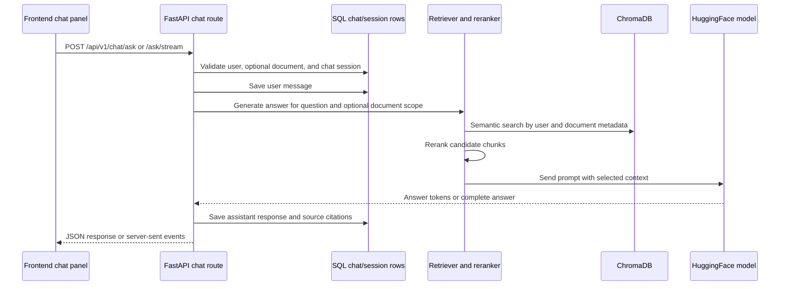
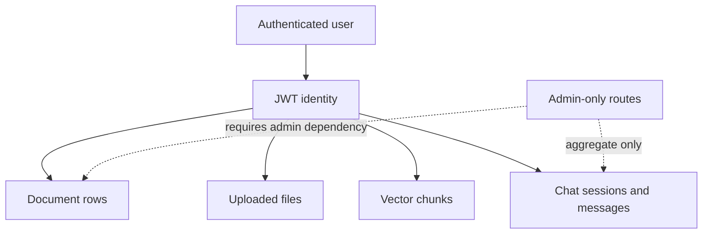

# Architecture Guide

This guide gives contributors a map of the PDF-Assistant-RAG runtime before
they change an endpoint, storage model, or RAG step. The README keeps the
product overview; this page focuses on how requests move through the system.

## Runtime Topology

The frontend is a Next.js application that talks to the FastAPI backend. In
development it usually runs on `http://localhost:3000`; the backend runs on
`http://localhost:8000` and exposes Swagger at `http://localhost:8000/docs`.
In production the backend can also serve the exported frontend from
`frontend/out` when that directory exists.

## Backend Route Groups

| Route group | Prefix | Responsibility |
| --- | --- | --- |
| Auth | `/api/v1/auth` | Registration, login, Google sign-in, JWT refresh, and profile state. |
| Documents | `/api/v1/documents` | File validation, upload records, background ingestion, status polling, file serving, deletion, and metadata updates. |
| Chat | `/api/v1/chat` | RAG questions, SSE streaming, chat sessions, history, exports, and shared answer links. |
| Admin | `/api/v1/admin` | Admin-only operational stats and user inventory. |
| GitHub | `/api/v1/github/stats` | Cached public repository statistics for the landing page. |
| Health | `/health`, `/api/health` | Lightweight service health checks for API, SQL, and Chroma availability. |

## Document Ingestion Flow

The upload route is intentionally strict before it writes long-lived state:
extension checks, size checks, MIME checks, and parser checks happen before the
file is moved into permanent storage. The background task owns expensive work
such as text extraction, chunking, embedding, graph building, and summary
generation.

## Chat And Retrieval Flow

Non-streaming chat returns a complete `ChatResponse`. Streaming chat uses
server-sent events so the frontend can render tokens as they arrive, then saves
the final assistant message after generation finishes.

## Data Ownership And Boundaries

User-facing routes must filter by `user.id` before reading or mutating
documents, chat sessions, messages, uploaded files, or vector chunks. Admin
routes use `get_current_admin` and should avoid returning secrets, tokens, file
contents, or raw vector payloads.

## Swagger And OpenAPI Notes

FastAPI builds the OpenAPI schema from route decorators, response models,
function names, parameter annotations, and docstrings. When adding or changing
an endpoint:

- Add a concise `summary` when the function name is not enough for Swagger.
- Use a docstring to describe ownership rules, side effects, and response shape.
- Keep `response_model` accurate so generated examples match real responses.
- Prefer typed query/body models over loosely shaped dictionaries.
- Mention asynchronous side effects, such as background ingestion or SSE
  streaming, in the route description.

## Local Contributor Checklist

Before opening a backend documentation or route metadata PR:

1. Run Python compilation for touched route files.
2. Run the fatal-error flake8 selection used by CI.
3. Check Markdown fences and Mermaid blocks render as plain GitHub Markdown.
4. Confirm the README links to any new contributor-facing docs.
